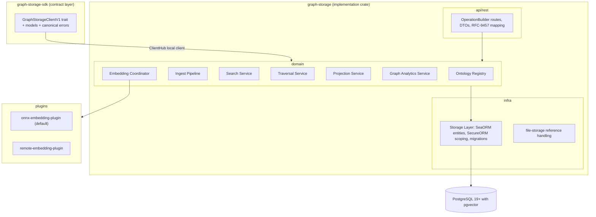
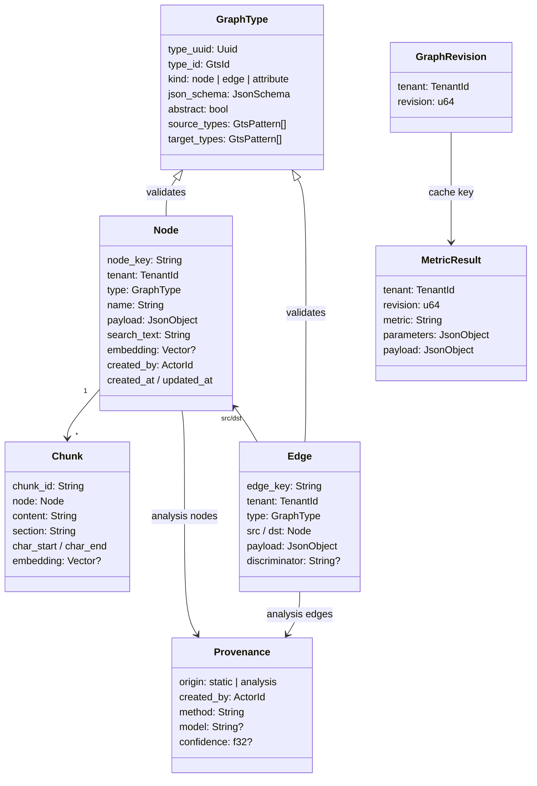

# Technical Design — Graph Storage

<!-- toc -->

- [1. Architecture Overview](#1-architecture-overview)
  - [1.1 Architectural Vision](#11-architectural-vision)
  - [1.2 Architecture Drivers](#12-architecture-drivers)
  - [1.3 Architecture Layers](#13-architecture-layers)
- [2. Principles & Constraints](#2-principles--constraints)
  - [2.1 Design Principles](#21-design-principles)
  - [2.2 Constraints](#22-constraints)
- [3. Technical Architecture](#3-technical-architecture)
  - [3.1 Domain Model](#31-domain-model)
  - [3.2 Component Model](#32-component-model)
  - [3.3 API Contracts](#33-api-contracts)
  - [3.4 Internal Dependencies](#34-internal-dependencies)
  - [3.5 External Dependencies](#35-external-dependencies)
  - [3.6 Interactions & Sequences](#36-interactions--sequences)
  - [3.7 Database schemas & tables](#37-database-schemas--tables)
- [4. Additional context](#4-additional-context)
  - [Prototype Lineage](#prototype-lineage)
  - [Phantom Materialization Contract](#phantom-materialization-contract)
  - [Traversal Backend Sketch](#traversal-backend-sketch)
  - [Capacity and Admission Contract](#capacity-and-admission-contract)
  - [Base Ontology Publication](#base-ontology-publication)
- [5. Traceability](#5-traceability)

<!-- /toc -->

## 1. Architecture Overview

### 1.1 Architectural Vision

Graph Storage is a stateless-above-PostgreSQL platform gear that stores one typed, multi-tenant knowledge graph and serves four query shapes over it: lexical/vector/hybrid search, depth-limited traversal, bounded projections, and whole-graph analytics. One relational store is the source of truth for everything — nodes, edges, chunks, types, vectors, and metric caches — so consistency, tenancy, and authorization are enforced in exactly one place.

The design generalizes the `studio-graph-storage` prototype: its data model (typed nodes and edges with GTS contracts, deterministic keys, phantom nodes, static/analysis edge split), its retrieval stack (tsvector + pgvector + RRF fusion, chunk folding), and its analytics surface are carried forward; its Python-only dependencies (Apache AGE, NetworkX, sentence-transformers) are replaced by decisions recorded in ADR-0001, ADR-0004, and ADR-0005; and platform obligations the prototype deliberately skipped — tenancy, access control, pagination, batched writes, observability — are designed in from the start.

The gear follows the standard ToolKit gear anatomy: an SDK crate exposing a typed client trait and transport-agnostic models, an implementation crate with API/domain/infra layers, and two plugin surfaces — embedding providers (ADR-0005) and graph engines behind the `GraphQueryPort` (ADR-0001), with the built-in PostgreSQL engine as the default graph-engine plugin.

### 1.2 Architecture Drivers

#### Functional Drivers

| Priority | Requirement | Design Response |
|----------|-------------|-----------------|
| `p1` | `cpt-cf-graph-storage-fr-type-registration` | Ontology Registry component validates draft-07 schemas, derives UUIDv5 identifiers via platform GTS, applies batches atomically, rejects conflicting re-registration |
| `p1` | `cpt-cf-graph-storage-fr-type-constraints` | Registry enforces abstractness and edge endpoint patterns; Ingest Pipeline validates payloads across the full GTS derivation chain with JSON-pointer error reporting |
| `p2` | `cpt-cf-graph-storage-fr-type-catalog` | Registry read endpoints list and fetch registered types with schemas, constraints, and derived UUIDs |
| `p1` | `cpt-cf-graph-storage-fr-bulk-ingest` | Ingest Pipeline validates whole batches, writes nodes/edges/chunks with batched statements in one transaction, bumps the tenant graph revision |
| `p1` | `cpt-cf-graph-storage-fr-stable-identity` | Producer-supplied node keys unique per tenant; edge keys derived as a hash of type, endpoints, and discriminator |
| `p1` | `cpt-cf-graph-storage-fr-reference-nodes` | Unified node table; owned/reference semantics carried by GTS base types per ADR-0002; all query components type-agnostic |
| `p2` | `cpt-cf-graph-storage-fr-phantom-nodes` | Ingest Pipeline materializes phantom-typed nodes for dangling edge endpoints; real ingest replaces phantoms in place |
| `p1` | `cpt-cf-graph-storage-fr-edge-provenance` | Provenance attribute type in the base ontology; scope replacement predicate excludes analysis-originated rows |
| `p1` | `cpt-cf-graph-storage-fr-scope-replace` | Declarative replace-scope executed in the ingest transaction: delete static rows of the scope absent from the batch |
| `p1` | `cpt-cf-graph-storage-fr-node-read` | Node read path joins node, chunk inventory, and adjacent edges with limits |
| `p2` | `cpt-cf-graph-storage-fr-content-chunking` | Chunker produces deterministic, offset-preserving chunks with location-encoded identifiers; chunks indexed and embedded individually |
| `p2` | `cpt-cf-graph-storage-fr-heavy-content-offload` | Payload size ceiling enforced at ingest; payloads reference file-storage identifiers that the gear never dereferences |
| `p1` | `cpt-cf-graph-storage-fr-embedding-pipeline` | Embedding Coordinator composes search text from vectorized attributes, batches provider calls, preserves vectors on non-embedding upserts |
| `p1` | `cpt-cf-graph-storage-fr-embedding-dim-guard` | Readiness compares the provider-declared embedding-space identity (model, tokenizer, preprocessing/pooling) and dimension against the identity recorded for stored vectors; mismatch fails readiness and blocks vector search; ingest rejects mismatched vector widths |
| `p1` | `cpt-cf-graph-storage-fr-lexical-search` | Lexical arm: web-style tsquery over node and chunk tsvectors with ranked results, snippets, and chunk-to-node folding |
| `p1` | `cpt-cf-graph-storage-fr-vector-search` | Vector arm: provider-embedded query against HNSW cosine indexes over node and chunk vectors, folded to nodes |
| `p1` | `cpt-cf-graph-storage-fr-hybrid-search` | Search Service runs both arms independently and fuses with RRF, reporting per-arm ranks |
| `p1` | `cpt-cf-graph-storage-fr-type-filtering` | GTS family patterns compiled to safe SQL patterns with literal-punctuation escaping, applied in every search arm |
| `p1` | `cpt-cf-graph-storage-fr-graph-traversal` | Traversal Service expands breadth-first through the GraphQueryPort: SQL/PGQ `GRAPH_TABLE` hop patterns from v1 for fixed-depth shapes (direction-explicit, per-hop dedup), depth-bounded recursive SQL for variable depth until PG20-class quantifiers, per ADR-0001 |
| `p1` | `cpt-cf-graph-storage-fr-neighborhood-projection` | Projection Service returns degree-ordered, budget-truncated neighborhoods with phantom toggle and metric annotations |
| `p1` | `cpt-cf-graph-storage-fr-tabular-projection` | Projection Service serves OData-filtered, paginated node tables over annotated (indexed) payload attributes |
| `p2` | `cpt-cf-graph-storage-fr-graph-metrics` | Graph Analytics Service computes degree, PageRank, components over a topology-only projection per ADR-0004 |
| `p3` | `cpt-cf-graph-storage-fr-graph-analytics-extended` | Seeded sampled Brandes betweenness and seeded Louvain-family communities with stable ordering; no NetworkX parity |
| `p2` | `cpt-cf-graph-storage-fr-metrics-cache` | Metric results cached by (tenant, graph revision, metric, parameters); cache/computed provenance reported |
| `p1` | `cpt-cf-graph-storage-fr-tenant-isolation` | Every entity is tenant-scoped through SecureORM; traversal recursion, search arms, and analytics loading carry the tenant predicate |
| `p1` | `cpt-cf-graph-storage-fr-access-control` | OperationBuilder-authenticated routes; PDP-checked permissions for ontology admin, ingest, and query declared as GTS instances |
| `p1` | `cpt-cf-graph-storage-fr-rest-api` | Versioned REST under `/api/graph-storage/v1` with OpenAPI schemas, RFC-9457 problems, documented limits |
| `p1` | `cpt-cf-graph-storage-fr-sdk-client` | SDK crate with `GraphStorageClientV1` trait registered in ClientHub; local client delegates to domain services |
| `p2` | `cpt-cf-graph-storage-fr-observability` | Structural tracing spans (batch sizes, arm timings, frontier sizes, cache hits) and OTel metrics, including per-limit saturation counters from the Capacity and Admission Contract; payload content never logged |
| `p1` | `cpt-cf-graph-storage-fr-readiness` | Readiness checks: DB, server major version (>= 19), pgvector presence, property-graph presence, migrations, embedding provider, dimension agreement — with named problems |

#### NFR Allocation

| Priority | NFR ID | NFR Summary | Allocated To | Design Response | Verification Approach |
|----------|--------|-------------|--------------|-----------------|----------------------|
| `p1` | `cpt-cf-graph-storage-nfr-ingest-throughput` | 10k nodes + 20k edges <= 60 s | Ingest Pipeline, Storage Layer | Batched multi-row statements, single transaction, validation before writes, bounded per-batch memory | Ingest benchmark suite on reference profile |
| `p1` | `cpt-cf-graph-storage-nfr-search-latency` | Hybrid p95 <= 500 ms at 100k nodes | Search Service, Storage Layer | Independent arm queries each using its index (GIN, HNSW), bounded arm limits, fusion in memory | Search benchmarks on seeded reference graph |
| `p1` | `cpt-cf-graph-storage-nfr-traversal-latency` | Depth-3 p95 <= 1 s at 500k edges | Traversal Service, Storage Layer | Composite edge indexes (tenant, src), (tenant, dst); per-hop frontier bounding; node budgets | Traversal benchmarks on seeded reference graph |
| `p2` | `cpt-cf-graph-storage-nfr-analytics-memory` | Topology-only, ceiling-enforced | Graph Analytics Service | Load node keys and typed edge pairs only; refuse graphs above any configured ceiling (nodes, edges, or estimated bytes — a node count alone does not bound memory on dense graphs) | Memory profiling tests |
| `p1` | `cpt-cf-graph-storage-nfr-tenant-zero-leak` | Zero cross-tenant results | Storage Layer, all query components | Tenant predicate injected by SecureORM scoping in every query including recursive CTEs; no raw unscoped SQL | Adversarial multi-tenant integration tests |
| `p1` | `cpt-cf-graph-storage-nfr-code-coverage` | >= 85% line coverage | All crates | Trait-based ports enable mock-driven unit tests; integration tests against real PostgreSQL | `cargo llvm-cov` in CI |

#### Key ADRs

| ADR ID | Decision | Materialized By |
|--------|----------|-----------------|
| [`cpt-cf-graph-storage-adr-single-postgres-store`](./ADR/0001-cpt-cf-graph-storage-adr-single-postgres-store.md) | Single PostgreSQL 19+ store (pgvector only); graph queries behind the GraphQueryPort with SQL/PGQ active from v1 (fixed-depth shapes) and recursive CTE for variable depth; pinned beta image until PG19 GA; Apache AGE not carried into the gear; dedicated traversal mirror as a measured-bottleneck contingency | `cpt-cf-graph-storage-principle-single-source-of-truth`, `cpt-cf-graph-storage-component-traversal-service`, `cpt-cf-graph-storage-component-storage-layer` |
| [`cpt-cf-graph-storage-adr-unified-node-model`](./ADR/0002-cpt-cf-graph-storage-adr-unified-node-model.md) | One typed node model; owned vs. reference semantics via GTS base types; provenance-gated scope replacement | `cpt-cf-graph-storage-principle-reference-not-replica`, `cpt-cf-graph-storage-principle-provenance-survives-resync`, `cpt-cf-graph-storage-component-ontology-registry`, `cpt-cf-graph-storage-component-ingest-pipeline` |
| [`cpt-cf-graph-storage-adr-metadata-partitioning`](./ADR/0003-cpt-cf-graph-storage-adr-metadata-partitioning.md) | Common columns + schema-declared indexed/vectorized attributes + payload ceiling with file-storage offload | `cpt-cf-graph-storage-principle-metadata-only-graph`, `cpt-cf-graph-storage-component-ontology-registry`, `cpt-cf-graph-storage-component-projection-service` |
| [`cpt-cf-graph-storage-adr-analytics-in-rust`](./ADR/0004-cpt-cf-graph-storage-adr-analytics-in-rust.md) | In-process Rust analytics with per-metric determinism contracts; NetworkX parity waived | `cpt-cf-graph-storage-component-graph-analytics-service` |
| [`cpt-cf-graph-storage-adr-embedding-provider`](./ADR/0005-cpt-cf-graph-storage-adr-embedding-provider.md) | Pluggable embedding provider; in-process ONNX default, remote plugin, deterministic fake for CI | `cpt-cf-graph-storage-component-embedding-coordinator`, `cpt-cf-graph-storage-constraint-single-embedding-space` |

### 1.3 Architecture Layers

Standard ToolKit gear layering:



- **SDK crate** (`graph-storage-sdk`): client trait, transport-agnostic models, GTS identifier constants for the base ontology. No serde/HTTP/DB dependencies.
- **API layer**: REST DTOs and handlers only; every route registered through OperationBuilder with authentication and permissions.
- **Domain layer**: the seven services above, expressed over storage ports; no infra types in domain signatures.
- **Infra layer**: SeaORM entities with `Scopable` tenancy, repositories generic over `DBRunner`, migrations, traversal SQL, and the file-storage reference adapter.
- **Plugins**: embedding providers behind the plugin contract, discovered via GTS plugin instances.

## 2. Principles & Constraints

### 2.1 Design Principles

#### Single Source of Truth

- [ ] `p1` - **ID**: `cpt-cf-graph-storage-principle-single-source-of-truth`

All graph state — nodes, edges, chunks, types, vectors, revisions, metric caches — lives in one PostgreSQL schema. No mirrors, no dual writes, no derived stores that can drift. ADR: [`cpt-cf-graph-storage-adr-single-postgres-store`](./ADR/0001-cpt-cf-graph-storage-adr-single-postgres-store.md).

#### Everything Is Typed

- [ ] `p1` - **ID**: `cpt-cf-graph-storage-principle-everything-typed`

No node or edge enters the graph without a registered GTS type, and no payload is stored without passing its full derivation-chain validation. The type registry is the contract boundary between independent producers.

#### Reference, Not Replica

- [ ] `p1` - **ID**: `cpt-cf-graph-storage-principle-reference-not-replica`

The graph never becomes a system of record for managed objects owned elsewhere. Reference nodes carry canonical identifiers plus bounded queryable projections; full records are fetched from the owning gear. ADR: [`cpt-cf-graph-storage-adr-unified-node-model`](./ADR/0002-cpt-cf-graph-storage-adr-unified-node-model.md).

#### Metadata-Only Graph

- [ ] `p1` - **ID**: `cpt-cf-graph-storage-principle-metadata-only-graph`

The graph stores what queries need: names, indexed attributes, vectorizable text, bounded content. Heavy content is rejected at the payload ceiling and lives in file storage, referenced by identifier. ADR: [`cpt-cf-graph-storage-adr-metadata-partitioning`](./ADR/0003-cpt-cf-graph-storage-adr-metadata-partitioning.md).

#### Provenance Survives Re-Sync

- [ ] `p1` - **ID**: `cpt-cf-graph-storage-principle-provenance-survives-resync`

Re-importing source data is always safe: scope replacement removes only static content, and analysis-originated nodes and edges — identified by provenance — persist across it.

#### Tenant-Scoped by Construction

- [ ] `p1` - **ID**: `cpt-cf-graph-storage-principle-tenant-scoped`

Every table carries tenancy and every query path — including recursive traversal SQL and analytics topology loading — goes through SecureORM scoping. There is no unscoped query API in the codebase.

#### Every Query Is Bounded

- [ ] `p1` - **ID**: `cpt-cf-graph-storage-principle-bounded-queries`

Every operation has explicit bounds — batch sizes, result limits, traversal depth, node/edge/byte budgets, deadlines, and per-tenant concurrency — defined by the [Capacity and Admission Contract](#capacity-and-admission-contract). Authoritative enforcement lives in the domain admission layer shared by REST and the ClientHub local client (API-edge validation is a fast-fail projection, never the only guard). Unbounded work is rejected with a canonical resource-exhausted error, never attempted.

### 2.2 Constraints

#### PostgreSQL with pgvector

- [ ] `p1` - **ID**: `cpt-cf-graph-storage-constraint-postgres-pgvector`

The storage backend is PostgreSQL 19 or later with the pgvector extension; SQL/PGQ is load-bearing from the first release, and readiness verifies the server major version and property-graph presence. Until PostgreSQL 19 GA, deployments run a pinned PG19 beta image with pgvector built from a pinned source revision (validated by the PG19 spike and the prototype); the image returns to stock PostgreSQL plus released pgvector at GA. No other extensions and no other database engines are supported; the gear does not target multi-engine portability because tsvector, JSONB indexing, pgvector, and SQL/PGQ are load-bearing.

#### GTS Draft-07 Contracts

- [ ] `p1` - **ID**: `cpt-cf-graph-storage-constraint-gts-draft07`

Type schemas are JSON Schema draft-07 with the platform GTS identifier grammar and UUIDv5 derivation (interoperable with the platform Rust GTS implementation), plus the gear's registered extension keywords for abstractness, endpoint constraints, indexing, and vectorization. Unknown extension keywords are rejected.

#### Gears Platform Integration

- [ ] `p1` - **ID**: `cpt-cf-graph-storage-constraint-gears-platform`

The gear integrates with the CF/Gears runtime: ToolKit gear lifecycle, OperationBuilder routes, SecurityContext, ClientHub registration, SecureORM tenancy, RFC-9457 errors, and platform observability.

#### One Embedding Space per Deployment

- [ ] `p1` - **ID**: `cpt-cf-graph-storage-constraint-single-embedding-space`

Exactly one embedding provider configuration is active per deployment at a time, identified by its full embedding-space identity (model artifact, tokenizer, preprocessing and pooling configuration) — not only its dimension. The identity under which stored vectors were produced is recorded durably; readiness verifies the active provider against it and blocks vector search on mismatch. The vector column dimension is fixed at migration time. Changing the model requires re-embedding. ADR: [`cpt-cf-graph-storage-adr-embedding-provider`](./ADR/0005-cpt-cf-graph-storage-adr-embedding-provider.md).

#### Payload Size Ceiling

- [ ] `p1` - **ID**: `cpt-cf-graph-storage-constraint-payload-ceiling`

Node payloads above the configured ceiling are rejected at ingest. The ceiling is a hard deployment constraint that keeps index maintenance and query latency predictable.

## 3. Technical Architecture

### 3.1 Domain Model



Domain vocabulary follows the PRD glossary. The base ontology published by the gear (owned-node base, reference-node base, phantom type, provenance attribute type, static and analysis edge bases) is part of the domain model: producers derive from it, and the ingest pipeline reads family semantics (owned/reference, static/analysis) from the type hierarchy rather than from per-request flags.

### 3.2 Component Model

#### Ontology Registry

- [ ] `p1` - **ID**: `cpt-cf-graph-storage-component-ontology-registry`

##### Why this component exists

Independent producers can only share one graph if a single component owns type registration, schema validation, and the derived-identifier mapping.

##### Responsibility scope

GTS identifier parsing and UUIDv5 derivation; draft-07 schema validation including the gear's extension keywords (abstract, endpoint constraints, indexed, vectorized — ADR-0003); idempotent, conflict-rejecting, batch-atomic registration; type catalog reads; an in-memory validator cache per registered type chain.

##### Responsibility boundaries

Does not validate instance payloads at query time (ingest does), does not own permission checks (routes do), does not publish the gear's own base types to the platform types-registry (the gear lifecycle does, once, at startup).

##### Related components (by ID)

- `cpt-cf-graph-storage-component-ingest-pipeline` — consumes compiled validator chains
- `cpt-cf-graph-storage-component-projection-service` — reads indexing annotations to admit filters

#### Ingest Pipeline

- [ ] `p1` - **ID**: `cpt-cf-graph-storage-component-ingest-pipeline`

##### Why this component exists

All writes go through one validated, transactional, idempotent path; ingest correctness is the gear's central invariant.

##### Responsibility scope

Batch validation (payloads against GTS chains, endpoint constraints, payload ceiling, vector dimensions); deterministic edge-key derivation; phantom materialization under the [Phantom Materialization Contract](#phantom-materialization-contract); scope replacement with the analysis-provenance exclusion predicate; batched multi-row writes in one transaction; graph-revision bump; per-item structured errors.

##### Responsibility boundaries

Does not compute embeddings (delegates to the Embedding Coordinator), does not chunk content (delegates to the Chunker), never dereferences file-storage identifiers.

##### Related components (by ID)

- `cpt-cf-graph-storage-component-ontology-registry` — validator chains
- `cpt-cf-graph-storage-component-chunker` — content splitting
- `cpt-cf-graph-storage-component-embedding-coordinator` — vector production
- `cpt-cf-graph-storage-component-storage-layer` — transactional writes

#### Chunker

- [ ] `p2` - **ID**: `cpt-cf-graph-storage-component-chunker`

##### Why this component exists

Passage-level retrieval requires deterministic, offset-faithful splitting of long content; chunk identity must encode location so re-ingest is idempotent.

##### Responsibility scope

Deterministic Markdown-aware chunking with size targets and tolerances; location-encoded chunk identifiers; exact raw-text offset preservation (asserted); table and oversized-block handling; content-hash computation for change detection.

##### Responsibility boundaries

Does not embed, index, or persist — it is a pure function from content to chunk sets.

##### Related components (by ID)

- `cpt-cf-graph-storage-component-ingest-pipeline` — sole caller

#### Embedding Coordinator

- [ ] `p1` - **ID**: `cpt-cf-graph-storage-component-embedding-coordinator`

##### Why this component exists

One component owns the embedding lifecycle so model identity, batching, and dimension guarantees hold across ingest and query paths (ADR-0005).

##### Responsibility scope

Search-text composition from name, vectorized attributes, and bounded content prefix; batched provider calls for node texts and chunks; per-request skip semantics with vector preservation; query-text embedding for the vector arm; exposure of the provider's embedding-space identity and dimension for readiness, and durable recording of the identity under which stored vectors were produced.

##### Responsibility boundaries

Does not implement any model — providers are plugins behind the embedding contract; does not decide which attributes are vectorizable (the schema annotations do).

##### Related components (by ID)

- `cpt-cf-graph-storage-component-ingest-pipeline` — ingest-time embedding
- `cpt-cf-graph-storage-component-search-service` — query-time embedding

#### Search Service

- [ ] `p1` - **ID**: `cpt-cf-graph-storage-component-search-service`

##### Why this component exists

Hybrid retrieval quality depends on running arms independently and fusing by rank; this component owns arms, fusion, and result provenance.

##### Responsibility scope

Lexical arm (web-style tsquery, rank, snippets over nodes and chunks); vector arm (cosine ANN over node and chunk vectors); chunk-to-node folding keeping best-chunk provenance; RRF fusion with per-arm rank reporting; GTS family-pattern filters with literal-punctuation escaping.

##### Responsibility boundaries

Does not traverse edges and does not paginate tables (Traversal and Projection do); does not embed text itself.

##### Related components (by ID)

- `cpt-cf-graph-storage-component-embedding-coordinator` — query embedding
- `cpt-cf-graph-storage-component-traversal-service` — consumes search hits as seeds
- `cpt-cf-graph-storage-component-storage-layer` — arm queries

#### Traversal Service

- [ ] `p1` - **ID**: `cpt-cf-graph-storage-component-traversal-service`

##### Why this component exists

Depth-limited expansion is the graph-native query shape; it needs dedicated, benchmarked, tenant-scoped graph querying with an engine strategy that can evolve (ADR-0001).

##### Responsibility scope

Owns the `GraphQueryPort` — the gear's graph-engine plugin surface (`cpt-cf-graph-storage-contract-graph-engine-plugin`). Engines behind the port declare capabilities (neighborhood, bounded traversal, shortest path, pattern queries, in-engine analytics) and answer undeclared operations with a typed not-implemented error. The default plugin is the built-in PostgreSQL engine with its two execution paths, both shipped in v1: SQL/PGQ (`CREATE PROPERTY GRAPH` over node/edge tables, direction-explicit `GRAPH_TABLE` hop patterns; serves fixed-depth shapes from the first release) and recursive CTE (depth-bounded iterative SQL over the indexed edge table; serves bounded variable-depth shapes until PG20-class quantifiers, and acts as the configuration-selected fallback). Seed resolution (explicit keys and/or hybrid hits); breadth-first expansion treating edges as undirected; per-hop edge-type restriction; output node-type filtering; node/edge budgets with seeds-survive-truncation semantics; hydrated subgraph responses with truncation status.

##### Responsibility boundaries

Does not rank results (search does), does not order by degree for UI budgets (projection does), never exceeds the system depth maximum. Backend selection is invisible to callers of the port. An external graph engine (ADR-0001 contingency; ArcadeDB is the candidate PoC) joins as another plugin implementing the same contract: it maintains a rebuildable projection of the edge table (PostgreSQL stays the system of record), serves capabilities the built-in engine lacks, and carries explicit tenant-isolation and consistency-lag obligations.

##### Related components (by ID)

- `cpt-cf-graph-storage-component-search-service` — seed source
- `cpt-cf-graph-storage-component-projection-service` — reuses expansion for neighborhoods
- `cpt-cf-graph-storage-component-storage-layer` — edge-table SQL

#### Projection Service

- [ ] `p1` - **ID**: `cpt-cf-graph-storage-component-projection-service`

##### Why this component exists

Consumers need bounded, renderable views — neighborhood subgraphs for UIs and paginated tables for lists — with predictable truncation.

##### Responsibility scope

Neighborhood projection (depth-bounded expansion, degree-ordered retention within node budgets, phantom toggle, optional metric annotations); tabular projection (type-family selection, identifier lists, OData filters restricted to annotation-indexed attributes, ordering, pagination); rejection of filters on unindexed attributes with the documented error.

##### Responsibility boundaries

Does not define which attributes are indexed (schema annotations do), does not compute metrics (annotates from the Graph Analytics Service cache).

##### Related components (by ID)

- `cpt-cf-graph-storage-component-traversal-service` — expansion primitive
- `cpt-cf-graph-storage-component-graph-analytics-service` — metric annotations
- `cpt-cf-graph-storage-component-ontology-registry` — filter admissibility

#### Graph Analytics Service

- [ ] `p2` - **ID**: `cpt-cf-graph-storage-component-graph-analytics-service`

##### Why this component exists

Whole-graph metrics need an in-memory topology and per-algorithm determinism contracts, isolated from interactive query paths (ADR-0004).

##### Responsibility scope

Topology-only projection loading (keys and typed edge pairs) under the configured node ceiling, canonicalized before any seeded algorithm runs (nodes by key, edges by type/source/target/discriminator, adjacency sorted, key-based tie-breaks — determinism comes from ordered inputs plus the seed, per ADR-0004); degree, components, PageRank; seeded sampled betweenness and seeded community detection with stable ordering; edge-type exclusion; revision-keyed cache reads/writes; cooperative cancellation.

##### Responsibility boundaries

Does not load payloads or vectors, refuses graphs above the ceiling, does not block request handling during computation.

##### Related components (by ID)

- `cpt-cf-graph-storage-component-storage-layer` — topology load and cache table
- `cpt-cf-graph-storage-component-projection-service` — metric annotation consumer

#### Storage Layer

- [ ] `p1` - **ID**: `cpt-cf-graph-storage-component-storage-layer`

##### Why this component exists

One infra component owns entities, tenancy scoping, migrations, and the hand-written traversal SQL so that tenant isolation is enforceable and auditable in one place.

##### Responsibility scope

SeaORM entities with `Scopable` tenancy; repositories generic over `DBRunner`; batched insert/upsert statements; the recursive traversal queries with injected tenant predicates; index definitions (composite edge indexes, tsvector GIN, payload-annotation indexes, HNSW vector indexes); migrations including vector dimension; readiness probes.

##### Responsibility boundaries

Contains no business rules; exposes typed ports consumed by domain services; raw SQL is confined here and covered by adversarial tenancy tests.

##### Related components (by ID)

- `cpt-cf-graph-storage-component-ingest-pipeline`, `cpt-cf-graph-storage-component-search-service`, `cpt-cf-graph-storage-component-traversal-service`, `cpt-cf-graph-storage-component-projection-service`, `cpt-cf-graph-storage-component-graph-analytics-service` — all data access

#### REST API

- [ ] `p1` - **ID**: `cpt-cf-graph-storage-component-rest-api`

##### Why this component exists

The HTTP boundary: DTOs, OpenAPI documentation, authentication, permission enforcement, limit validation, and RFC-9457 mapping.

##### Responsibility scope

OperationBuilder route registration under `/api/graph-storage/v1`; DTO validation of all bounds (batch sizes, limits, depths); permission declaration and checks per operation group (ontology admin, ingest, query); problem-details mapping from domain errors; readiness endpoint.

##### Responsibility boundaries

No business logic; handlers delegate to domain services and map results.

##### Related components (by ID)

- All domain components — delegation targets
- `cpt-cf-graph-storage-component-local-client` — shares domain service access

#### Local Client

- [ ] `p1` - **ID**: `cpt-cf-graph-storage-component-local-client`

##### Why this component exists

In-process consumers (producer and consumer gears) integrate through the ClientHub trait, not HTTP.

##### Responsibility scope

Implements `GraphStorageClientV1` from the SDK crate over the same domain services and the same security context path as REST; registered in ClientHub at gear init.

##### Responsibility boundaries

No behavior differences from REST beyond transport; identical permission checks and identical admission limits apply — the Capacity and Admission Contract is enforced in the shared domain layer, so the in-process path can never bypass a bound that REST enforces.

##### Related components (by ID)

- `cpt-cf-graph-storage-component-rest-api` — behavioral parity requirement

### 3.3 API Contracts

The public surfaces are defined in the PRD as `cpt-cf-graph-storage-interface-rest-api` and `cpt-cf-graph-storage-interface-sdk-client`, with external contracts `cpt-cf-graph-storage-contract-gts-ontology`, `cpt-cf-graph-storage-contract-embedding-provider`, and `cpt-cf-graph-storage-contract-graph-engine-plugin` (the two plugin contracts follow the platform pattern: plugin trait + GTS-registered plugin instances discovered via types-registry and resolved through ClientHub scoped clients).

**REST surface** (`/api/graph-storage/v1`, all operations authenticated and permission-checked):

| Group | Operations |
|-------|-----------|
| Types | register type batch; list types (by kind); get type |
| Ingest | ingest batch (nodes, edges, options: skip-embedding, phantom control, replace scope) |
| Nodes | get node by key (payload, chunk inventory, adjacency) |
| Search | lexical, vector, hybrid (query, limits, type filters) |
| Graph | traversal (seeds/query, depth, edge-type filters); neighborhood projection; tabular projection (OData) |
| Metrics | compute/read metrics (selection, edge-type exclusion) |
| Health | readiness with named problems |

**SDK client** (`GraphStorageClientV1`): async trait mirroring the same operation groups with transport-agnostic models and canonical platform errors; registered in ClientHub.

**Error contract**: RFC-9457 problem details; validation failures carry per-item error lists (item index, GTS type, JSON pointer, message).

### 3.4 Internal Dependencies

- `toolkit` (gear macro, lifecycle, OperationBuilder, ClientHub), `toolkit-db`/SecureORM (Scopable entities, DBRunner, SecureTx), `toolkit-gts` (identifier grammar, UUIDv5, schema/instance registration), `toolkit-odata` (tabular projection filtering), `toolkit-canonical-errors` (SDK error surface).
- Platform gears: authz-resolver (PDP), types-registry (base ontology and permission instances), file-storage (heavy-content references only — the gear stores identifiers, consumers resolve them).

### 3.5 External Dependencies

- PostgreSQL 19+ with pgvector (storage; HNSW cosine indexes; SQL:2023 property graph queries in core, used from v1). Until PG19 GA: pinned beta image with pgvector built from a pinned source revision (upstream PG19 support landed July 2026).
- ONNX Runtime and a MiniLM-class sentence-embedding model (default embedding plugin), or a remote inference endpoint (alternative plugin), per ADR-0005.
- Rust graph and algorithm crates for the analytics component (petgraph-family), per ADR-0004.

### 3.6 Interactions & Sequences

#### Batch Ingest with Scope Replacement

**ID**: `cpt-cf-graph-storage-seq-ingest-batch`

**Actors**: `cpt-cf-graph-storage-actor-producer-gear`

```
1. Producer calls ingest (nodes, edges, options)        [REST or SDK client]
2. AuthN/AuthZ: ingest permission, tenant scope         [REST API / Local Client]
3. Validate batch: GTS chains, endpoint constraints,    [Ingest Pipeline +
   payload ceiling, key derivation                       Ontology Registry]
4. Chunk long content deterministically                 [Chunker]
5. Compose search texts; batch-embed nodes + chunks     [Embedding Coordinator]
   (skipped when embed=false; existing vectors kept)
6. One transaction:                                     [Storage Layer]
   batched upserts (nodes, edges, chunks)
   + phantom materialization
   + scope replacement (static rows only)
   + graph revision bump
7. Return per-item results, phantom list, revision
```

#### Hybrid Search

**ID**: `cpt-cf-graph-storage-seq-hybrid-search`

**Actors**: `cpt-cf-graph-storage-actor-data-analyst`, `cpt-cf-graph-storage-actor-consumer-gear`

```
1. Query arrives with type filters and limits
2. Query text embedded via active provider              [Embedding Coordinator]
3. Lexical arm and vector arm run independently         [Search Service]
   (each over nodes UNION chunks, tenant-scoped,
    type-family filters applied in SQL)
4. Chunk hits fold to parent nodes (best chunk kept)
5. RRF fusion; hits report arms and per-arm ranks
6. Ranked nodes returned with snippets and payloads
```

#### UI Neighborhood Exploration

**ID**: `cpt-cf-graph-storage-seq-ui-neighborhood`

**Actors**: `cpt-cf-graph-storage-actor-graph-explorer`

```
1. UI requests neighborhood(node_key, depth<=3, budget)
2. Depth-bounded breadth-first expansion                [Traversal Service]
   (recursive SQL, tenant predicate, edge-type filters)
3. Degree-ordered retention within node budget;         [Projection Service]
   phantoms excluded if requested; seeds always kept
4. Optional metric annotations from cache               [Graph Analytics Service]
5. Subgraph + truncation status returned for rendering
```

#### Metrics Computation and Caching

**ID**: `cpt-cf-graph-storage-seq-metrics-refresh`

**Actors**: `cpt-cf-graph-storage-actor-data-analyst`

```
1. Metrics requested (selection, edge-type exclusions)
2. Cache lookup by (tenant, revision, metric, params)   [Graph Analytics Service]
3. On miss: load topology projection under ceiling
   (keys + typed edges only, tenant-scoped)
4. Compute per determinism contracts (ADR-0004)
5. Store in cache keyed by revision; report
   cached vs. computed per metric
```

### 3.7 Database schemas & tables

- [ ] `p1` - **ID**: `cpt-cf-graph-storage-db-schema`

Single PostgreSQL schema; all tables tenant-scoped; vector dimension fixed by migration and verified at readiness. Index plan: composite edge indexes (tenant, src) / (tenant, dst) / (tenant, type); GIN over generated tsvectors; expression/GIN indexes over annotation-declared payload attributes; HNSW cosine indexes over embeddings.

#### Table: graph_type

**ID**: `cpt-cf-graph-storage-dbtable-graph-type`

| Column | Type | Description |
|--------|------|-------------|
| id | SMALLINT PK | Interned type id |
| tenant_id | UUID | Tenant scope |
| type_uuid | UUID UNIQUE | Deterministic UUIDv5 of the GTS identifier |
| type_id | TEXT UNIQUE | Human-readable GTS identifier |
| kind | TEXT | node / edge / attribute |
| json_schema | JSONB | Draft-07 schema with gear extension keywords |
| created_at | TIMESTAMPTZ | Registration time |

#### Table: node

**ID**: `cpt-cf-graph-storage-dbtable-node`

| Column | Type | Description |
|--------|------|-------------|
| id | BIGINT PK | Internal id |
| tenant_id | UUID | Tenant scope |
| node_key | TEXT | Producer-supplied stable key, unique per tenant |
| type_id | SMALLINT FK | graph_type reference |
| name | TEXT | Display name |
| payload | JSONB | GTS-validated attributes (ceiling-bounded) |
| search_text | TEXT | Composed vectorizable text |
| search | TSVECTOR generated | Lexical index source |
| embedding | VECTOR(dim) | Node embedding (nullable) |
| created_by | TEXT | Creating actor |
| created_at / updated_at | TIMESTAMPTZ | Timestamps |

#### Table: edge

**ID**: `cpt-cf-graph-storage-dbtable-edge`

| Column | Type | Description |
|--------|------|-------------|
| id | BIGINT PK | Internal id |
| tenant_id | UUID | Tenant scope |
| edge_key | TEXT | Deterministic hash of type, src, dst, discriminator; unique per tenant |
| type_id | SMALLINT FK | graph_type reference |
| src_node_id / dst_node_id | BIGINT FK | Endpoints (cascade on node delete) |
| payload | JSONB | GTS-validated attributes incl. provenance |
| created_at | TIMESTAMPTZ | Timestamp |

#### Table: chunk

**ID**: `cpt-cf-graph-storage-dbtable-chunk`

| Column | Type | Description |
|--------|------|-------------|
| id | BIGINT PK | Internal id |
| tenant_id | UUID | Tenant scope |
| node_id | BIGINT FK | Parent node |
| chunk_id | TEXT UNIQUE | Location-encoded identifier |
| content | TEXT | Chunk text |
| content_hash | TEXT | Change detection |
| section / char_start / char_end | TEXT / INT / INT | Location |
| search | TSVECTOR generated | Lexical index source |
| embedding | VECTOR(dim) | Chunk embedding (nullable) |

#### Table: graph_meta

**ID**: `cpt-cf-graph-storage-dbtable-graph-meta`

| Column | Type | Description |
|--------|------|-------------|
| tenant_id | UUID | Tenant scope |
| key | TEXT | Meta key (e.g., graph_revision) |
| value | JSONB | Meta value |

#### Table: metrics_cache

**ID**: `cpt-cf-graph-storage-dbtable-metrics-cache`

| Column | Type | Description |
|--------|------|-------------|
| tenant_id | UUID | Tenant scope |
| graph_revision | BIGINT | Revision the result was computed at |
| metric | TEXT | Metric name + canonicalized parameters |
| payload | JSONB | Per-node metric values |
| computed_at | TIMESTAMPTZ | Computation time |

## 4. Additional context

### Prototype Lineage

The `studio-graph-storage` prototype validates this design's data model and retrieval stack. Deliberate departures: Apache AGE removed (ADR-0001), NetworkX replaced (ADR-0004), sentence-transformers replaced by the provider contract (ADR-0005), whole-payload GIN indexing replaced by annotation-declared indexes (ADR-0003), and row-at-a-time writes replaced by batched statements (`cpt-cf-graph-storage-nfr-ingest-throughput`). Tenancy, access control, and pagination are new platform obligations the prototype did not carry.

### Phantom Materialization Contract

The transition `phantom -> concrete` (a real ingest arriving under a node key currently held by a phantom, `cpt-cf-graph-storage-fr-phantom-nodes`, ADR-0002) is governed by an atomic transition contract:

1. **Identity is preserved.** The phantom and the materialized node are the same row: same node key, same internal identifier. Incident edges are never rewritten, re-keyed, or re-created by the transition.
2. **Eligibility.** A phantom may materialize into any registered, non-abstract node type — the phantom is a typeless placeholder, and materialization is type assignment. The reverse transition (concrete to phantom) never happens; a later ingest that would only create a phantom for an existing concrete key is a no-op against that node.
3. **Incident-edge revalidation.** In the same transaction, every edge incident to the node is revalidated against the concrete type's endpoint constraints (edges attached while the node was a phantom could not be endpoint-checked). Any violation rejects the entire ingest batch with per-item errors naming the offending edges; nothing is mutated. Producers resolve the conflict by fixing the ontology or the batch, never by partial application.
4. **Atomicity.** Type assignment, payload validation, edge revalidation, and the write commit or roll back as one transaction. No intermediate state (typed node with unrevalidated edges, half-assigned payload) is ever observable by concurrent readers.
5. **Concurrency and idempotency.** Materialization serializes on the node row via the per-tenant node-key uniqueness constraint: concurrent phantom creation and materialization (or two concurrent materializations) resolve deterministically — one transaction wins, the other observes the winner's committed state and proceeds as an upsert (or retries on serialization failure). Re-ingesting the same concrete node is a converging no-op.

Consequences for shapes outside the happy path: a second edge referencing the same missing key reuses the existing phantom (no duplicate placeholders); scope replacement treats phantoms as static content (a phantom whose last referencing edge is deleted is subject to the retention policy tracked in PRD § Open Questions).

### Traversal Backend Sketch

The `GraphQueryPort` is the graph-engine plugin surface (`cpt-cf-graph-storage-contract-graph-engine-plugin`): engines declare capabilities and answer undeclared operations with a typed not-implemented error. The built-in PostgreSQL engine is the default plugin; its two execution paths implement the same port contract (seeds, bounded expansion, per-hop filters, budgets, truncation semantics) and ship in v1.

**SQL/PGQ backend** (active from v1 for fixed-depth shapes): a `CREATE PROPERTY GRAPH` definition over the node and edge tables (vertex label from `graph_type`, edge label with source/destination keys); fixed-depth neighborhood queries compile to `GRAPH_TABLE` pattern matches that join freely with pgvector KNN and tsvector predicates in the same statement and inherit indexes, `EXPLAIN`, RLS, and secure-ORM scoping.

**Recursive-CTE backend**: iterative frontier expansion (one bounded recursive CTE, or per-hop queries when per-hop edge-type filters differ): frontier(depth 0) = seeds; each hop joins the edge table on both directions with the tenant predicate, optional edge-type set, and a visited-set exclusion; expansion stops at the depth bound or node budget. Serves bounded variable-depth requests until SQL/PGQ gains variable-length paths (expected PG20+) and remains the configuration-selected fallback; the port hides the split.

The PG19 validation spike gating the traversal implementation freeze (ADR-0001 Confirmation) has run against PG19 beta2 + pgvector built from source — see [SPIKE-pg19-sqlpgq.md](./SPIKE-pg19-sqlpgq.md). Two binding implementation rules follow from it: the PGQ backend must emit direction-explicit patterns (the undirected shorthand plans as an all-vertex probe on the initial PG19 implementation), and neighborhood expansion must chain `GRAPH_TABLE` as a directed 1-hop primitive with per-hop dedup (multi-hop chain patterns enumerate paths and explode on hubs). Measured at reference shape (200k nodes / 660k edges, depth <= 3, random seeds): CTE p95 4.1 ms, PGQ hop-chain p95 8.8 ms — both far inside the NFR budget; single-statement KNN + graph + FTS composition confirmed at ~20-40 ms.

The full graph-engine evaluation behind this strategy (12-engine scoreboard, FalkorDB/ArcadeDB smoke tests, AGE growth map, mirror-swap contingency triggers) is preserved in [graph-engine-alternatives.md](./graph-engine-alternatives.md).

### Capacity and Admission Contract

Every bound the gear enforces is a named configuration key with a safe default and a hard range (operators can tune within the range; values outside it are rejected at startup). Defaults are initial spec-level values — benchmarks may adjust them before v1 freeze, within the stated ranges.

| Bound | Config key (`graph-storage.limits.`) | Default | Hard range | Enforced at |
|---|---|---|---|---|
| Ingest batch: nodes | `ingest_max_nodes` | 10,000 | 1 – 50,000 | Admission |
| Ingest batch: edges | `ingest_max_edges` | 20,000 | 1 – 100,000 | Admission |
| REST request body | `rest_max_body_bytes` | 32 MiB | 1 – 128 MiB | REST edge |
| Node payload size | `payload_max_bytes` | 64 KiB | 1 KiB – 1 MiB | Admission (ADR-0003 ceiling) |
| Node content size | `content_max_bytes` | 2 MiB | 64 KiB – 16 MiB | Admission |
| Traversal depth | `traversal_max_depth` | 5 | 1 – 8 | Admission |
| Traversal node budget | `traversal_max_nodes` | 1,000 per request, 10,000 hard | 1 – 10,000 | Admission + per hop |
| Traversal frontier per hop | `traversal_max_frontier` | 10,000 | 100 – 100,000 | Engine, per hop |
| Traversal edges scanned | `traversal_max_edges_scanned` | 100,000 | 1,000 – 1,000,000 | Engine, cumulative |
| Search arm limit | `search_max_arm_limit` | 50 | 1 – 500 | Admission |
| Projection page size | `projection_max_page` | 200 | 1 – 1,000 | Admission |
| Analytics node ceiling | `analytics_max_nodes` | 1,000,000 | 1,000 – 10,000,000 | Job admission |
| Analytics edge ceiling | `analytics_max_edges` | 10,000,000 | 10,000 – 100,000,000 | Job admission |
| Analytics memory budget | `analytics_max_bytes` | 2 GiB | 128 MiB – 32 GiB | Job admission (estimate from node/edge counts and key sizes) + allocation tracking |
| Interactive statement deadline | `deadline_interactive` | 10 s | 1 – 60 s | DB `statement_timeout` + cancellation token |
| Analytics job deadline | `deadline_analytics` | 300 s | 10 s – 3,600 s | Cancellation token |
| Per-tenant concurrent analytics jobs | `tenant_max_analytics_jobs` | 1 | 1 – 8 | Job admission |
| Per-tenant concurrent ingest batches | `tenant_max_ingest` | 4 | 1 – 64 | Admission |
| Per-tenant concurrent queries | `tenant_max_queries` | 32 | 1 – 1,024 | Admission |

Enforcement is layered, and the authoritative layer is shared:

1. **REST edge** — DTO validation and body-size caps as a fast-fail projection of the contract; never the only guard.
2. **Domain admission layer** — the authoritative check, executed identically for REST handlers and the ClientHub local client; nothing reaches storage or an engine backend without passing it. Per-tenant concurrency gates live here.
3. **Execution backstops** — database `statement_timeout`, cooperative cancellation tokens on long computations, and per-hop/cumulative budget checks inside the traversal engines.

Every rejection maps to the canonical resource-exhausted problem type (RFC-9457) carrying the limit name, the configured bound, and the requested value — distinguishable from validation errors so clients can implement backoff rather than "fix the request". Every limit exposes a saturation counter (rejections) and a high-watermark gauge, so capacity pressure is visible in telemetry before it becomes an incident (`cpt-cf-graph-storage-fr-observability`).

### Base Ontology Publication

At startup the gear registers its GTS base types (owned-node base, reference-node base, phantom, provenance attribute, static/analysis edge bases) and its permission instances with the platform types-registry through the standard inventory mechanism, so producers can derive types and administrators can grant permissions before any runtime registration happens.

## 5. Traceability

- **PRD**: [PRD.md](./PRD.md)
- **ADRs**: [ADR/](./ADR/)
